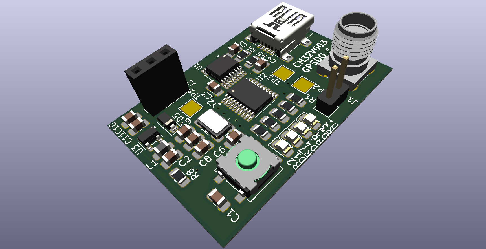

For using the external resonator, see ``ch32fun/examples/external_crystal`` and set
```
#define FUNCONF_USE_HSE 1               // Use External Oscillator
#define FUNCONF_USE_PLL 0               // Do not use built-in 2x PLL
```
in ``funconfig.h``.

Check watchdog timer in ``ch32fun/examples/iwdg``.
