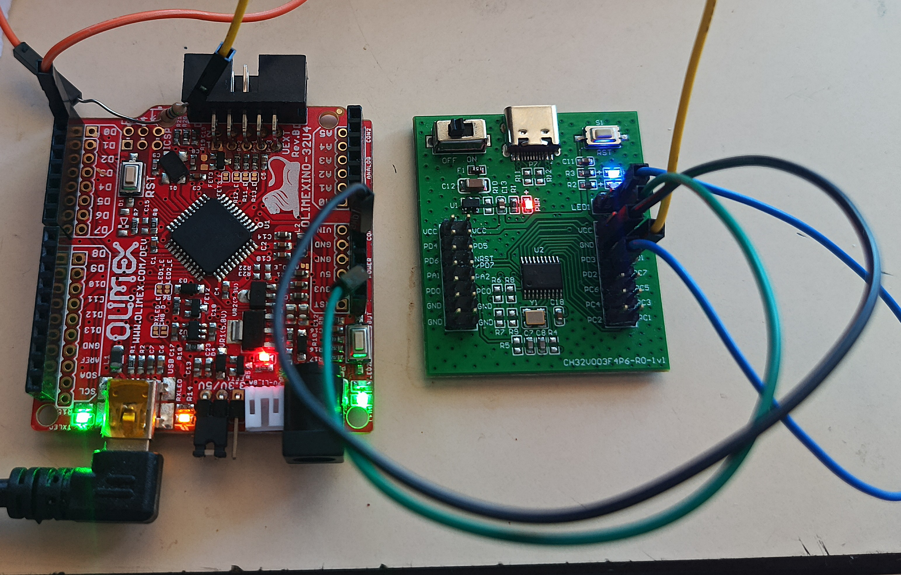

# Atmega32U4 programmer for CH32V003

Based on https://gitlab.com/BlueSyncLine/arduino-ch32v003-swio with the following
updates:
* disable interrupts during communication to meet timing requirements due to the usage of ...
* USB communication using LUFA and its interrupt driven implementation (no polling in the main loop) provided by https://git.jim.sh/jim/lufa-ftdi.git
included as a submodule. In ``lufa-ftdi``: rename ``main.c`` to ``main.something`` 
to avoid dupplicate main functions during the compilation

## Usage:

``make`` to compile
``make flash`` to program the Olimexino32U4 board fitted with the AVR109 bootloader
``make test`` to probe the CH32V003 connected to pin named D0 (Atmega32U4 PD2) through a 1kohm resistor
``make write`` to flash a blinking LED program to the CH32V003, assuming the https://github.com/cnlohr/ch32fun repository
is a the same directory level than this repository.

## Results

```
$ make test
../ch32fun/minichlink/minichlink -c /dev/ttyUSB3 -C ardulink -i
minichlink version - 2a8542e218c7ff47d54bb2aaafab3756d3e0d667
Opening serial port /dev/ttyUSB3 at 115200 baud.
Ardulink: synced.
Ardulink: target power 1
Interface Setup
Detected CH32V003
Flash Storage: 16 kB
Part UUID: 9b-77-ab-cd-04-72-bd-2e
Part Type: 00-30-05-10
Read protection: disabled
USER/RDPR  : 08f7/5aa5
DATA1/DATA0: 00ff/00ff
WRPR1/WRPR0: 00ff/00ff
WRPR3/WRPR2: 00ff/00ff
R32_ESIG_UNIID1: 9b77abcd
R32_ESIG_UNIID2: 0472bd2e
R32_ESIG_UNIID3: ffffffff
```

```
$ make write
../ch32fun/minichlink/minichlink -c /dev/ttyUSB3 -C ardulink -w ../ch32fun/examples/gpio_and_adc/gpio_and_adc.bin flash -b
minichlink version - 2a8542e218c7ff47d54bb2aaafab3756d3e0d667
Opening serial port /dev/ttyUSB3 at 115200 baud.
Ardulink: synced.
Ardulink: target power 1
Interface Setup
Detected CH32V003
Flash Storage: 16 kB
Part UUID: 9b-77-ab-cd-04-72-bd-2e
Part Type: 00-30-05-10
Read protection: disabled
Writing image

Image written.
```



CH32V003 Arduino SWIO interface
===============================

This is a very simple implementation of a SWIO interface for the CH32V003
    microcontroller.

It is intended to run on a stock Arduino Uno R3 board running at 16 MHz.


Connections
-----------

The wiring is simple:

*   `AVR PB0` (Arduino pin __8__) goes to the SWIO pin of the CH32V003.

    While it'll work if connected directly, an 1k resistor in series is advised
    to prevent overcurrent, because a bus conflict is intentionally created as a
    part of the RX logic.

*   `AVR PB1` (Arduino pin __9__) is used to switch power to the target.

    Without external devices, the microcontroller's current draw should be
    low enough to be sustained by a simple GPIO.

Building and flashing the AVR
-----------------------------
You'll need avr-gcc and avrdude.
For the flashing script, the interface chosen is `/dev/ttyACM0`.

```
make
./flash.sh
````

Protocol
--------
The protocol runs over UART at 8N1 115200 bps.
    
The stock Arduino board features the ability to reset the AVR using the DTR
    line. You can use that to re-initialize the adapter whenever desired.

When it goes ready, a `!` character is output.

Most commands produce a `+` character to acknowledge their execution.

When arguments are required, they're transmitted as bytes following the command
    byte.

The supported commands are as follows:

* `?` - Test UART communication.
    * Arguments: none
    * Response: `+`

* `p` - Target power on.
    * Arguments: none
    * Response: `+`

* `P` - Target power off.
    * Arguments: none
    * Response: `+`

* `w` - Write target's debug register.
    * Arguments:
        * `1 byte` - debug register number (`0x00` ... `0x7f`)
        * `4 bytes` - value (LSB-first 32-bit int)
    * Response: `+`

* `r` - Read target's debug register.
    * Arguments:
        * `1 byte` - debug register number (`0x00` ... `0x7f`)

    * Response:
        * `4 bytes` - contents of the register.

