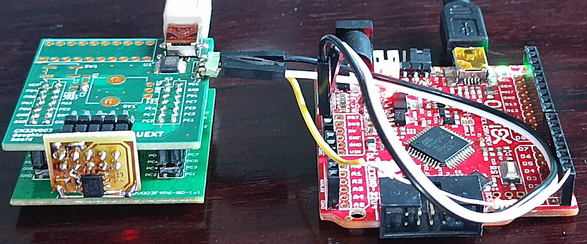
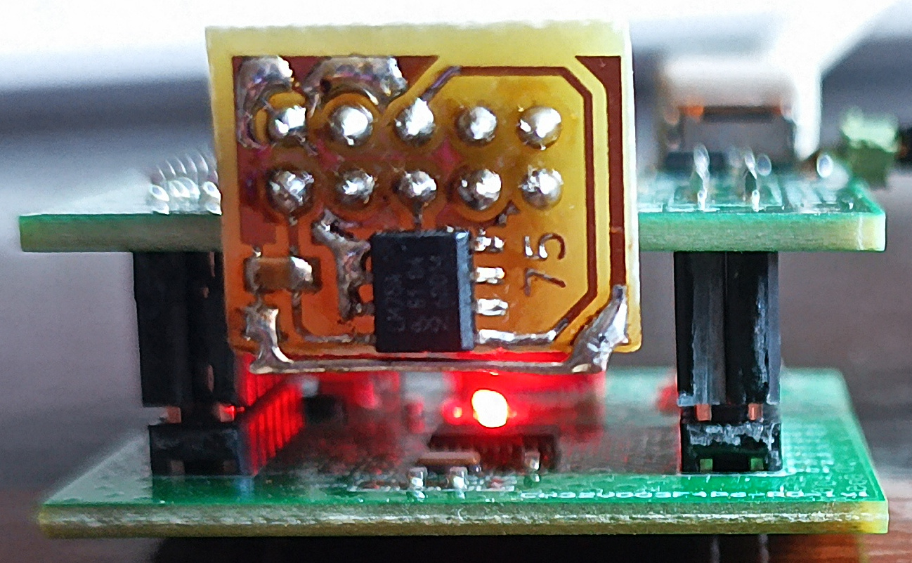
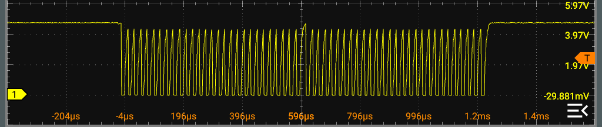
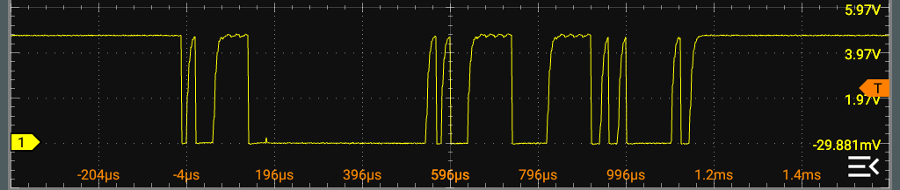

# <a href="https://www.ti.com/lit/ds/symlink/lm75b.pdf?ts=1783767986413&ref_url=https%253A%252F%252Fwww.ti.com">LM75 I2C</a> temperature sensor

## Usage

Move ``CH32V00x_lib_i2c`` to ``ch32fun/examples/`` and move ``i2c_lm75.c`` to ``ch32fun/examples/CH32V00x_lib_i2c``. Update
the ``Makefile`` in this directory so that ``TARGET:=i2c_lm75`` and

```
make
```

## Output

In a terminal connected to the virtual serial port of the RISCV: notice that device 0x4F=0x9E/2 responded, meaning the A0=A1=A2=1

```
----Scanning I2C Bus for Devices----
Address: 0x4F Responded.
----Done Scanning----

030.0
030.0
030.0
030.0
030.0
030.0
030.0
030.0
030.0
030.0
030.0
030.0
030.0
030.5
030.5
030.5
030.5
030.5
030.5
031.0
031.0
031.0
031.0
031.0
031.0
031.0
031.0
031.0
031.0
031.0
031.5
```








