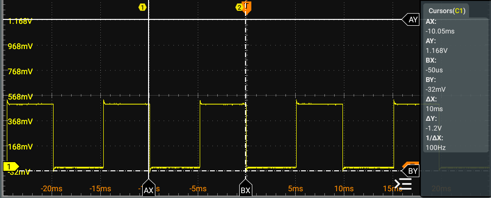
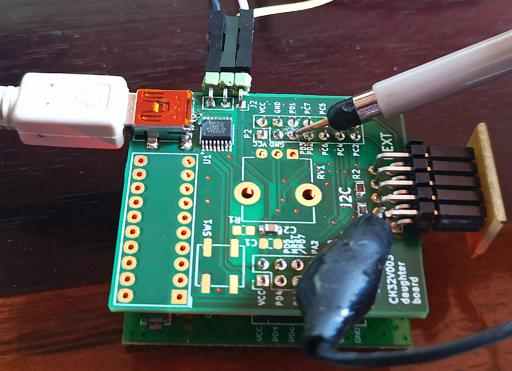
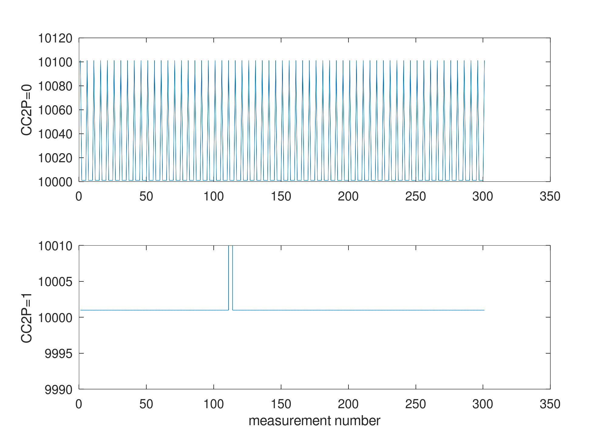
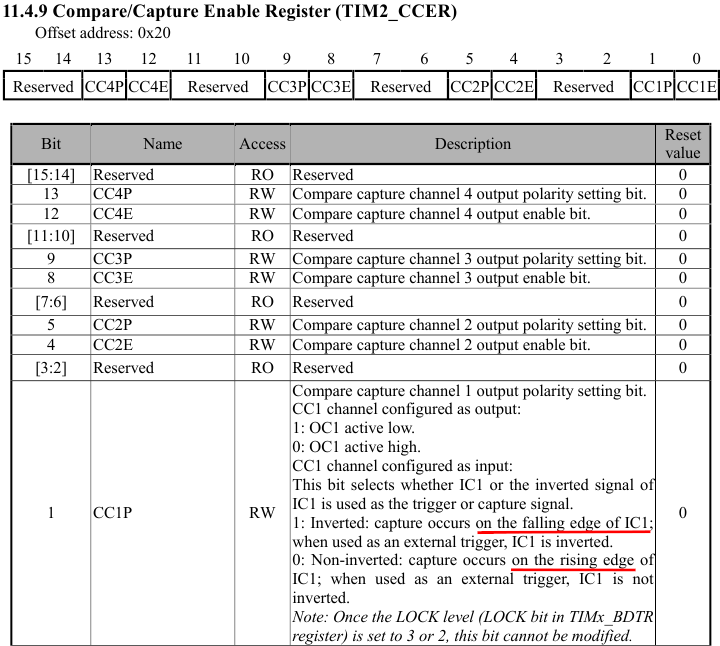

# Demonstration of PWM using Timer 2 and IC using Time 1

Based on ``ch32fun/examples/tim2_pwm/`` and ``ch32fun/examples/input_capture/``

## Use

Short pins PD3 (PWM output) and PD2 (Input capture) with an oscilloscope probe
for observing the varying duty cycle of the PWM and the timer measurement when
triggering on the rising edge (constant period, 10 ms) or falling edge (periodic
jump by 100 us when increasing the duty cycle).

Input Capture edge selection register, from the CH32V003 Reference Manual:

